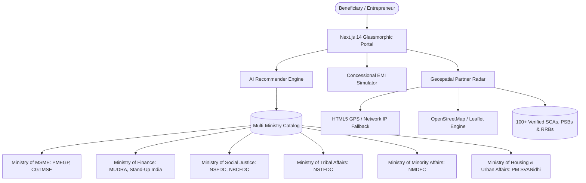

# Samarthya Setu (सामर्थ्य सेतु)
### *All-India AI-Driven Scheme Matching & Concessional Channel Finance Platform*

[](https://nextjs.org/)
[](https://fastapi.tiangolo.com/)
[](https://www.typescriptlang.org/)
[](https://www.python.org/)
[](https://leafletjs.com/)
[](#multilingual-support)
[](https://opensource.org/licenses/MIT)

---

## Executive Overview

**Samarthya Setu (सामर्थ्य सेतु)** is a high-availability, unified digital public infrastructure (DPI) platform engineered to dismantle informational and institutional barriers for Indian micro-entrepreneurs, artisans, and disadvantaged groups. 

Instead of searching dozens of disparate government websites, entrepreneurs across all 28 States and 8 Union Territories can discover, verify, simulate, and route their loan applications across flagship Central Ministries and Apex Finance Corporations in seconds.



---

## Core Capabilities

### 1. Multi-Ministry All-India Scheme Engine
- **Cross-Portal Aggregation**: Consolidates schemes from the Ministry of MSME, Ministry of Finance, Ministry of Social Justice & Empowerment, Ministry of Tribal Affairs, Ministry of Minority Affairs, and MoHUA.
- **Demographic Inclusivity**: Fully supports entrepreneurs across **General, OBC, SC, ST, Minorities, and Women-led** enterprises.
- **Deep Eligibility Reasoning**: Analyzes caste criteria, annual family income ceilings (including the ₹3L-₹5L national benchmark), educational qualification, project capital limits, and statutory documentation requirements.
- **Transparent Direct Links**: Every scheme provides verified direct links to official government portals (e.g. *udyamimitra.in*, *kviconline.gov.in*, *standupmitra.in*, *nsfdc.nic.in*, *pmsvanidhi.mohua.gov.in*).

### 2. Native Multilingual Localization (7 Languages)
Seamless, instant language switching without page reload across 7 major Indian languages:
- **English** (Default)
- **हिन्दी** (Hindi)
- **తెలుగు** (Telugu)
- **தமிழ்** (Tamil)
- **ಕನ್ನಡ** (Kannada)
- **मराठी** (Marathi)
- **বাংলা** (Bengali)

### 3. Concessional EMI & Moratorium Simulator
- **True Moratorium Phasing**: Accurately models interest-only grace periods (0 to 18 months) during enterprise gestation.
- **Commercial Bank Comparative**: Calculates exact lifecycle rupee savings compared to the standard 13.5% commercial bank lending benchmark.
- **Defensive Math Engine**: Zero-NaN mathematical formatting safeguards ensure uninterrupted financial forecasting under all edge cases and offline modes.
- **Interactive Visual Timeline**: Visual bar showing moratorium vs. amortization phases plus month-by-month repayment schedule.

### 4. Samarthya Sahayak — Conversational AI Agent 🤖
- **Tool-Grounded Advisory**: A chat agent that answers in natural language by invoking the platform's own verified services — never invents schemes or numbers.
  - `scheme_matching_engine` — "Which schemes am I eligible for?" → personalized top matches with rates, subsidies and official apply links (respects the strict hide-ineligible rules).
  - `concessional_emi_calculator` — "EMI for a ₹15 lakh loan over 7 years?" → EMI, moratorium interest, and savings vs the commercial benchmark.
  - `channel_partner_locator` — "Where do I apply near me?" → active channel partners with address, phone and disbursement TAT.
- **Message-Based Profile Extraction**: Understands amounts ("2 lakh", "2.5cr", "50k"), gender, social category, SHG/Udyam/Divyang status and trade mentions to enrich the current form profile.
- **Transparent Reasoning**: Every reply carries a `tools_used` trace, surfaced in the UI as a 🔧 footer so users see exactly which service produced the answer.
- **Works Fully Offline**: Deterministic intent routing + template answers need no API key. Optionally set `OPENAI_API_KEY` (or `GEMINI_API_KEY`) and the LLM polishes the phrasing of the same verified facts (facts always stay server-side).
- **Floating Widget**: Available on every tab via the 🤖 button, pre-loaded with quick prompts and personalized by the current beneficiary profile.

### 5. Geospatial Channel Partner Radar & Branch Locator
- **Multi-Tiered Geolocation**:
  1. High-speed browser GPS with battery/desktop safety timeouts.
  2. Automatic network IP-based fallback if GPS access is blocked or unavailable.
  3. One-click quick-select regional hubs (**Delhi NCR, Mumbai, Bengaluru, Hyderabad, Chennai, Kolkata, Lucknow, Jaipur**).
  4. **Click-to-Locate on Map**: Click anywhere on the map to drop a pin and find nearby partners.
- **Proximity Ranking**: Real-time Haversine distance calculations sort institutions by proximity.
- **Banking Health Safeguards**: Automatically flags or excludes branches with high NPA rates (>5%) and checks fund utilization rates.
- **Direct Citizen Action**: Tap to dial phone numbers, email branch nodal officers, or focus directly on the interactive Leaflet map.

### 6. Enterprise Reliability & Error Boundaries
- Equipped with Next.js 14 App Router error boundaries (`error.tsx` and `global-error.tsx`) to prevent reload loops and provide one-click graceful recovery.

---

## Schemes Covered Across Government Portals

| Scheme Code | Scheme Title | Governing Ministry / Apex Body | Concessional Rate | Max Project Limit | Key Highlights & Subsidies | Official Portal |
|---|---|---|---|---|---|---|
| **PMEGP** | Prime Minister’s Employment Generation Programme | Ministry of MSME / KVIC | Benchmark Base Rate | ₹50.00 Lakhs | 15% to 35% Capital Margin Subsidy | [kviconline.gov.in](https://www.kviconline.gov.in/pmegpeportal/) |
| **MUDRA-SHISHU** | Pradhan Mantri MUDRA Yojana (Shishu) | Ministry of Finance / MUDRA | 7.5% – 9.0% p.a. | ₹50,000 | Zero collateral micro-enterprise credit | [mudra.org.in](https://www.mudra.org.in/) |
| **MUDRA-KISHORE** | Pradhan Mantri MUDRA Yojana (Kishore) | Ministry of Finance / MUDRA | 8.0% – 10.0% p.a. | ₹5.00 Lakhs | Scaling credit for working capital | [mudra.org.in](https://www.mudra.org.in/) |
| **MUDRA-TARUN** | Pradhan Mantri MUDRA Yojana (Tarun) | Ministry of Finance / MUDRA | 8.5% – 11.0% p.a. | ₹10.00 Lakhs | Expansion loan for established units | [mudra.org.in](https://www.mudra.org.in/) |
| **STANDUP-INDIA** | Stand-Up India Scheme | Ministry of Finance / SIDBI | Bank Base Rate + (1-3%) | ₹100.00 Lakhs | Dedicated to SC, ST & Women entrepreneurs | [standupmitra.in](https://www.standupmitra.in/) |
| **PM-VISHWAKARMA** | PM Vishwakarma Yojana | Ministry of MSME / Skill Dev | 5.0% p.a. Concessional | ₹3.00 Lakhs | ₹15,000 Toolkit Grant + 8% Interest Subvention | [pmvishwakarma.gov.in](https://pmvishwakarma.gov.in/) |
| **PM-SVANIDHI** | PM Street Vendor’s AtmaNirbhar Nidhi | MoHUA / SIDBI | 7.0% Interest Subsidy | ₹50,000 | Collateral-free micro-credit for urban vendors | [pmsvanidhi.mohua.gov.in](https://pmsvanidhi.mohua.gov.in/) |
| **NSFDC-TL** | Term Loan Scheme (General Enterprise) | MoSJE / NSFDC | 6.0% p.a. Concessional | ₹50.00 Lakhs | Covers up to 90% project cost for SC artisans | [nsfdc.nic.in](https://nsfdc.nic.in/) |
| **NSFDC-MCF** | Micro Credit Finance Scheme | MoSJE / NSFDC | 5.0% p.a. Concessional | ₹1.50 Lakhs | Quick credit via Self Help Groups | [nsfdc.nic.in](https://nsfdc.nic.in/) |
| **NSFDC-MSY** | Mahila Samriddhi Yojana | MoSJE / NSFDC | 4.0% p.a. Subsidized | ₹1.40 Lakhs | Exclusive concessional finance for SC women | [nsfdc.nic.in](https://nsfdc.nic.in/) |
| **NSTFDC-TERM** | NSTFDC Term Loan for ST Entrepreneurs | MoTA / NSTFDC | 6.0% p.a. Concessional | ₹50.00 Lakhs | Up to 90% funding for Scheduled Tribes | [nstfdc.tribal.gov.in](https://nstfdc.tribal.gov.in/) |
| **NBCFDC-GLS** | NBCFDC General Loan Scheme | MoSJE / NBCFDC | 6.0% – 7.0% p.a. | ₹15.00 Lakhs | Targeted credit for Backward Classes | [nbcfdc.gov.in](https://nbcfdc.gov.in/) |
| **NMDFC-TERM** | Term Loan Scheme for Minorities | MoMA / NMDFC | 6.0% p.a. Concessional | ₹30.00 Lakhs | Credit for Muslims, Christians, Sikhs, Buddhists, Parsis, Jains | [nmdfc.org](https://www.nmdfc.org/) |
| **CGTMSE** | Credit Guarantee Fund Trust for MSEs | Ministry of MSME / SIDBI | Commercial Bank Standard | ₹500.00 Lakhs | Up to 85% credit guarantee without third-party collateral | [cgtmse.in](https://www.cgtmse.in/) |

---

## Technology Architecture

| Layer | Framework / Library | Role & Functionality |
|---|---|---|
| **Frontend Framework** | **Next.js 14** (App Router) | Server-side rendering, client hydration, dynamic route proxying |
| **Frontend Language** | **TypeScript 5.0+** | Strict static typing, type-safe API communication |
| **Styling & Theme** | **Vanilla Semantic CSS Tokens** | Zero CSS framework bloat, instant dark/light theme switching, glassmorphism |
| **Mapping & Geospatial** | **Leaflet 1.9.4 & OpenStreetMap** | Dynamic HTML markers, pulsing user location beacons, interactive popups |
| **Backend API** | **FastAPI (Python 3.11+)** | High-performance asynchronous REST API with automatic OpenAPI Swagger docs |
| **Data Validation** | **Pydantic v2** | Strict validation of project inputs, demographics, and loan parameters |
| **Containerization** | **Docker & Docker Compose** | Multi-container unified local and production orchestration |

---

## Directory Structure

```
AI-Driven-Scheme-/
├── backend/
│   ├── app/
│   │   ├── api/v1/
│   │   │   ├── schemes.py             # Scheme catalog & evaluation endpoints
│   │   │   ├── calculator.py          # Concessional EMI simulation endpoint
│   │   │   ├── partners.py            # Channel partner geospatial router
│   │   │   ├── matching.py            # AI scheme matcher endpoint
│   │   │   ├── agent.py               # Sahayak conversational AI agent endpoint
│   │   │   └── users.py               # Profile persistence
│   │   ├── core/                      # Settings & security configuration
│   │   ├── schemas/                   # Pydantic schemas
│   │   │   ├── scheme.py
│   │   │   ├── calculator.py
│   │   │   └── partner.py
│   │   ├── services/                  # Business logic
│   │   │   ├── matching_engine.py
│   │   │   ├── financial_calculator.py
│   │   │   ├── scheme_advisor_agent.py # Sahayak tool-calling agent
│   │   │   └── channel_partner_service.py
│   │   └── main.py                    # FastAPI entrypoint
│   ├── requirements.txt
│   └── Dockerfile
├── frontend/
│   ├── src/
│   │   ├── app/
│   │   │   ├── layout.tsx             # Root layout with comprehensive metadata
│   │   │   ├── page.tsx               # Command center tab interface
│   │   │   ├── not-found.tsx          # Custom 404 error page
│   │   │   ├── error.tsx              # Client-side error boundary
│   │   │   └── global-error.tsx       # Root layout global error boundary
│   │   ├── components/
│   │   │   ├── Navbar.tsx             # Theme toggle & 7-language selector
│   │   │   ├── SchemeCard.tsx         # Score gauge, subsidy chips, documents
│   │   │   ├── FinancialCalculator.tsx# Concessional debt & moratorium simulator
│   │   │   ├── PartnerLocator.tsx     # GPS + IP map with proximity routing
│   │   │   └── AIAssistantChat.tsx    # Sahayak AI agent floating chat widget
│   │   ├── lib/
│   │   │   ├── api.ts                 # Type-safe API client & India-wide dataset
│   │   │   ├── LanguageContext.tsx    # Context provider for multi-language state
│   │   │   └── translations.ts        # Full dictionaries for 7 languages
│   │   └── styles/
│   │       ├── global.css             # Glassmorphism, animations, responsive resets
│   │       └── variables.css          # Semantic CSS color tokens
│   ├── next.config.js                 # API rewrite proxy
│   ├── package.json
│   └── tsconfig.json
├── docker-compose.yml
└── README.md
```

---

## Quickstart & Local Development

### Prerequisites
- **Node.js**: v18.0 or higher
- **Python**: v3.11 or higher
- **Git**

### 1. Clone the Repository
```bash
git clone https://github.com/Basithmd024/AI-Driven-Scheme-.git
cd AI-Driven-Scheme-
```

### 2. Launch the Backend API
```bash
cd backend
python3 -m venv venv
source venv/bin/activate
pip install -r requirements.txt
uvicorn app.main:app --host 0.0.0.0 --port 8000 --reload
```
- **API Base**: `http://localhost:8000/api/v1`
- **Swagger Documentation**: `http://localhost:8000/docs`
- **System Health Status**: `http://localhost:8000/api/v1/status`

### 3. Launch the Frontend
In a new terminal window:
```bash
cd frontend
npm install
npm run dev
```
- **Web Portal**: `http://localhost:3000`

---

## Docker Deployment

To launch the complete platform using Docker Compose:
```bash
docker-compose up --build
```
This builds and connects:
- Frontend on `http://localhost:3000`
- Backend API on `http://localhost:8000`

---

## API Documentation

### Scheme Matching & Recommendation
- **`POST /api/v1/matching/evaluate`**
  - Evaluates user profile against all-India schemes and returns match scores, eligibility status, required documents, and channel partner routing rules.

### Concessional Loan Simulator
- **`POST /api/v1/calculator/calculate`**
  - Computes net loan, promoter margin, monthly EMI, moratorium simple interest, total repayment outflow, and direct rupee savings versus the 13.5% commercial benchmark.

### Channel Partner Radar
- **`POST /api/v1/partners/locate`**
  - Accepts GPS coordinates (`user_lat`, `user_lng`) and filters (`state`, `category`, `active_only`) to return institutions ranked by proximity with NPA health metrics.

### Conversational AI Agent (Sahayak)
- **`POST /api/v1/agent/chat`**
  - Body: `{ "message": "...", "profile": { ...EntrepreneurProfile }, "history": [...], "language": "en" }`
  - Routes the question to the matching engine, EMI calculator, or partner locator and returns `{ "reply", "tools_used", "engine", "agent: "sahayak" }`.
  - `engine` is `"llm"` when an `OPENAI_API_KEY`/`GEMINI_API_KEY` is configured (phrasing only), otherwise `"rule-based"`. Fully functional without any key.
  - Example: `curl -X POST /api/v1/agent/chat -H 'Content-Type: application/json' -d '{"message":"EMI for 15 lakh loan for 7 years?"}'`

---

## Contributing

1. Fork the Project
2. Create your Feature Branch (`git checkout -b feature/AmazingFeature`)
3. Commit your Changes (`git commit -m 'Add some AmazingFeature'`)
4. Push to the Branch (`git push origin feature/AmazingFeature`)
5. Open a Pull Request

---

## License

Distributed under the **MIT License**. See `LICENSE` for more information.
